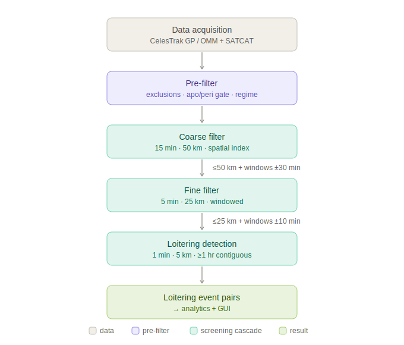
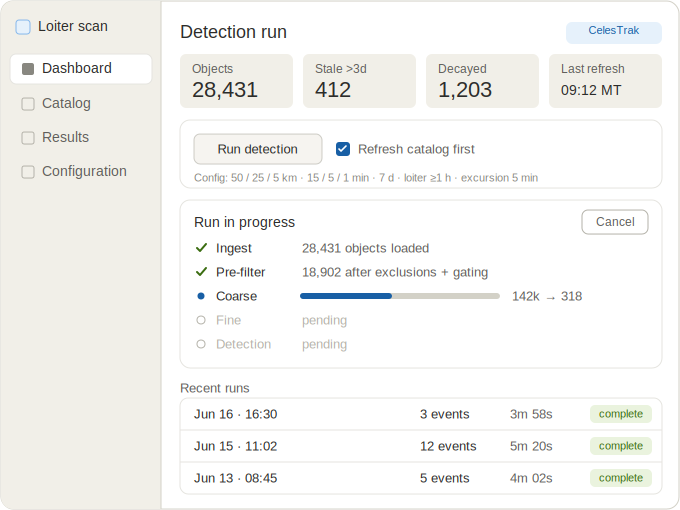
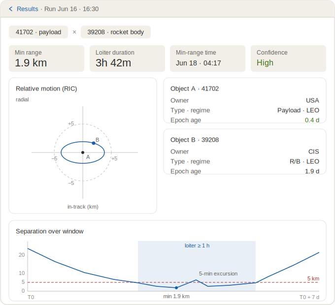
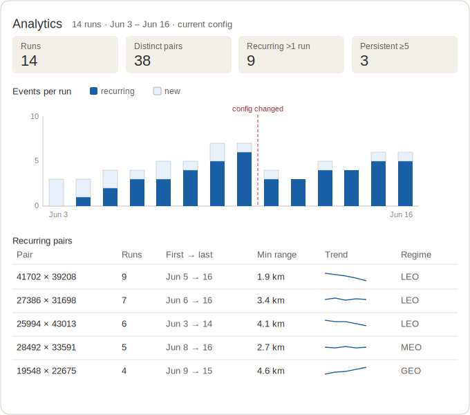

# Serendipitous Satellite Loitering Detection — Software Specification

**Status:** Design baseline · **Version:** 0.1 · **Date:** 2026-06-17

This document is the consolidated design baseline for the application. It captures the
architecture, the four major components, the data model, the detection algorithm and its
parameters, and the decisions and rationale behind them. It is intended to live in the
GitLab repository as the reference specification.

---

## 1. Purpose and scope

The application identifies **serendipitous loitering** of satellite pairs: pairs of catalog
objects that enter and remain in close relative proximity without that proximity being an
intentional formation, constellation arrangement, or co-location. It is a forward-looking
screening tool: each run predicts loitering events over a 7-day horizon from the time of
execution.

The application is a stand-alone Windows desktop executable. Configuration management uses a
GitLab repository.

### 1.1 Definition of loitering

Two objects are *loitering* when their separation is **≤ 5 km for a continuous span of ≥ 1 hour**.

The span is evaluated as continuous, with a tolerance for brief excursions:

- At 1-minute sampling, a qualifying event is ≥ 60 samples ≤ 5 km.
- Excursions above 5 km lasting **≤ 5 minutes** are bridged: the loiter timer is not reset, and
  the bridged minutes still count toward the 1-hour total.
- The timer resets only when an excursion exceeds 5 minutes.

This range-and-duration test is a deliberate proxy for bounded relative motion. A genuine loiter
appears as a bounded relative path; a single slow flyby does not satisfy the sustained-duration
criterion.

---

## 2. System architecture

The system is organized into four major components plus a shared persistence layer:

1. **Data acquisition** — pulls and maintains the local satellite catalog.
2. **Detection engine** — the tiered screening cascade that produces loitering events.
3. **GUI** — the user-facing WPF desktop application.
4. **Analytics** — cross-run aggregation (trends and recurring pairs).

Data flows: acquisition populates a local SQLite catalog → the detection engine reads the
catalog and produces loitering event pairs → the GUI presents results and hosts the analytics
views → analytics aggregates across the run history.

The detection engine is kept decoupled from the GUI as a clean internal boundary (testable in
isolation; leaves room for a future CLI or scheduled mode). This decoupling is a design
preference, not a hard requirement for v1.

---

## 3. Technology stack

| Concern | Choice |
|---|---|
| Language / runtime | .NET / C# |
| GUI framework | WPF |
| UI pattern | MVVM (CommunityToolkit.Mvvm) |
| Local store / ORM | SQLite via EF Core (migrations + seeding) |
| Serialization | System.Text.Json (OMM ingestion) |
| Charting | ScottPlot.WPF |
| 3D visualization (optional, later) | HelixToolkit (confirm current maintenance before adopting) |
| Propagator (v1) | Vallado reference SGP4 behind a pluggable interface |
| Packaging | `dotnet publish -r win-x64 --self-contained -p:PublishSingleFile=true` |
| CI/CM | GitLab with a Windows build runner |

**Packaging note:** WPF does not support trimming or NativeAOT, so the single-file executable
bundles the full runtime and will be sizeable. This is expected.

---

## 4. Data acquisition

### 4.1 Source

The catalog source sits behind a **swappable source interface**.

- **v1 source of record: CelesTrak** — provides GP element data, SATCAT metadata, and named
  GROUP lists (used for constellation exclusion).
- **Future: Space-Track** — to be swapped in as the authoritative source of record, and the only
  source for `GP_History` if historical element sets are later required.

Cache aggressively and pull the catalog in bulk rather than per object; both sources rate-limit
or firewall abusive access patterns.

### 4.2 Format and scope

- Ingest the **GP class in OMM format (JSON)**, *not* 2-line TLEs. Rationale: the TLE format
  cannot represent the 6–9-digit catalog numbers arriving as the catalog exhausts 5-digit
  numbers (expected mid-2026), and the legacy TLE API classes are being deprecated in favor of
  GP / OMM. OMM also carries the `EPHEMERIS_TYPE` field, so the same ingestion path serves
  standard SGP4 (type 0) today and SGP4-XP (type 4) after a future upgrade.
- Pull the **full public catalog including debris**. Debris must be present in the store so it
  can be optionally excluded via a filter toggle.

### 4.3 Local catalog (SQLite)

- One table of element sets, storing the OMM mean elements plus B\*, ephemeris type, epoch,
  ingest timestamp, and source. Catalog number stored as a wide integer (9-digit ready).
- A joined SATCAT metadata table: object type (drives the debris flag), owner / country,
  operational status, decay date. Joined on NORAD catalog ID.
- GROUP membership tags from CelesTrak (e.g. `starlink`, `oneweb`) to drive constellation
  exclusion.
- **Derived fields computed on ingest:** semi-major axis, apogee radius, perigee radius, and
  orbital regime. Computing these once at ingest lets the pre-filter read precomputed columns
  instead of recomputing per pair.

### 4.4 Freshness and integrity

- Track each element set's **epoch age** and surface it as a confidence signal.
- Flag objects with a decay date.
- Dedupe superseded element sets to newest-per-object.
- Handle objects present in GP but absent from SATCAT (and vice versa) without crashing the join.

---

## 5. Detection engine

### 5.1 Propagator interface

The propagator is a **pluggable interface that accepts mean elements directly** — mean motion,
eccentricity, inclination, RAAN, argument of perigee, mean anomaly, B\*, and epoch — never a TLE
string. (Feeding a TLE string would reintroduce the 5-digit catalog-number limit that the OMM
decision removes.)

- **v1 implementation:** Vallado public reference SGP4, dropped in behind the interface.
- **Future implementation:** native interop to the USSF AstroStds library for SGP4-XP, once
  type-4 (XP-fitted) element sets can be sourced. The interface stays element-based and
  propagator-agnostic so this is a drop-in.

### 5.2 Cascade overview

The engine is a funnel of progressively tighter thresholds and finer time sampling. Each tier
re-propagates only the survivors of the previous tier, and only within the **candidate time
windows** flagged upstream (plus a buffer), so fine-resolution work is confined to the moments
that matter.

**Buffer rule:** the time-window buffer carried into each tier is **2× the upstream tier's
sampling step** (one step to cover the threshold-crossing gap, one for margin):

- Coarse → Fine: **±30 min**
- Fine → Detection: **±10 min**



*Figure 1 — The detection cascade. Each tier re-propagates only the survivors of the previous tier, within the flagged time windows plus buffer.*

### 5.3 Tier 1 — Pre-filter

Reduces the candidate set before any propagation:

- Exclude large constellations (via CelesTrak GROUP lists).
- Exclude selected countries of origin.
- Exclude selected satellite names or IDs.
- Debris exclusion (toggle).
- **Apogee/perigee gating:** eliminate any pair whose altitude separation makes proximity
  impossible — if one object's perigee radius exceeds the other's apogee radius by more than the
  coarse threshold, the pair can never come within range and is dropped analytically.
- **Orbital regime** is a user **scope toggle** (e.g. "LEO only"), used for intentional scope
  reduction — *not* as an automatic pair-eliminator. Apogee/perigee gating performs the rigorous
  elimination, since a regime hard-filter would wrongly drop eccentric orbits that cross regimes.

### 5.4 Tier 2 — Coarse filter

- Propagate each surviving object from T0 to T0 + 7 days at **15-minute** steps.
- At each time step, build a **spatial index (k-d tree / grid)** over the ECI positions and run a
  radius query, rather than comparing all pairs — turning per-step work from O(N²) into roughly
  O(N log N).
- Threshold: **50 km**. Pairs within 50 km at any step pass, carrying their candidate time
  windows forward.

### 5.5 Tier 3 — Fine filter

- Re-propagate surviving pairs at **5-minute** steps, windowed to the coarse-flagged windows
  ± 30 min.
- Threshold: **25 km**. Survivors pass with refined time windows.

### 5.6 Tier 4 — Loitering detection

- Re-propagate surviving pairs at **1-minute** steps, windowed to the fine-flagged windows
  ± 10 min.
- Threshold: **5 km**, evaluated against the loitering definition in §1.1 (contiguous ≥ 1 hour,
  5-minute bridged excursions).
- Output: the **loitering event pairs** list, persisted to `loitering_events`.

### 5.7 Cascade parameters (summary)

| Parameter | Value |
|---|---|
| Propagation horizon | T0 → T0 + 7 days |
| Coarse step / threshold | 15 min / 50 km |
| Fine step / threshold | 5 min / 25 km |
| Detection step / threshold | 1 min / 5 km |
| Loiter duration | ≥ 1 hour |
| Excursion allowance | ≤ 5 min (bridged) |
| Coarse → Fine buffer | ± 30 min |
| Fine → Detection buffer | ± 10 min |

All of the above are stored as editable configuration (see §6).

---

## 6. Persistence and configuration

Configuration is stored in the database and is editable via the UI. To reconcile UI-editable
config with the project's configuration-management goal, two mechanisms apply:

1. The config tables are **seeded on first launch from a versioned default config file** in the
   repo, so defaults remain under version control and a fresh install is reproducible.
2. **Every run records a snapshot of the exact config that produced it**, so results stay
   reproducible and auditable even though config is mutable.

### 6.1 Schema

- **`config_params`** — scalar parameters: cascade thresholds (50 / 25 / 5 km), step sizes
  (15 / 5 / 1 min), horizon (7 d), buffers (± 30 / ± 10 min), loiter duration (1 h), excursion
  allowance (5 min), and the `refresh_before_run` flag. All UI-editable.
- **`excl_countries`**, **`excl_ids`**, **`excl_groups`** — exclusion lists, managed as editable
  lists in the UI. Plus the debris-include boolean and regime-scope toggle.
- **`runs`** — `run_id`, `started_at`, `trigger` (always `on-demand` in v1; column retained for
  future automation), catalog epoch window, **config snapshot**, status, and a result summary.
- **`loitering_events`** — keyed to `run_id`; carries a canonical **`pair_key`**
  (the unordered `(min(norad_a, norad_b), max(...))`, indexed), the pair's close-approach details
  (min range, predicted close-approach time, loiter span and duration), per-object metadata
  references, and an epoch-age-derived confidence value.

### 6.2 Validation

Config edits are validated before commit, including monotonic thresholds (50 > 25 > 5) and step
ordering (15 > 5 > 1).

---

## 7. GUI (WPF)

A main window with a left navigation rail and five primary views. Navigation is view-model-first
(a `ContentControl` swaps views in the shell).

### 7.1 Views

- **Dashboard / Run** (home) — catalog status (source, last refresh, object count, stale and
  decayed counts), the run trigger with a per-run "refresh catalog first" override (defaulting to
  the `refresh_before_run` config value), live per-phase run progress, and a recent-runs list
  from the `runs` table.
- **Results** — the loitering event pairs for a selected run, in a virtualized data grid.
- **Event detail** — the deep dive on one pair: the RIC (radial / in-track / cross-track)
  relative-motion plot centered on the primary, a range-vs-time plot with the 5 km threshold, the
  shaded qualifying loiter span and any bridged excursions, plus both objects' metadata and the
  confidence rating.
- **Catalog** — browse the local catalog with derived fields and freshness flags. UI
  virtualization is required given the catalog's tens of thousands of rows.
- **Configuration** — edit the `config_params` and `excl_*` tables with the validation in §6.2.
- **Analytics** — see §8.

### 7.2 Run execution model

A run walks ingest → pre-filter → coarse → fine → detection and takes minutes, so it must not
block the UI thread:

- The view-model invokes the decoupled engine core as an `async Task`.
- Progress is reported per phase via `IProgress<T>` with live counts.
- A `CancellationToken` allows the user to abort.

Runs are **UI-triggered only**; there is no automatic/scheduled run in v1.

### 7.3 Interface mockups

The Run/Dashboard view is the application home: catalog status, the run trigger with the
refresh-first override, per-phase run progress with cancellation, and the recent-runs history.



*Figure 2 — Run / Dashboard view (run in progress).*

The Event-detail view is the deep dive on one loitering pair, built around the RIC relative-motion
plot (a bounded path near the origin is the signature of true loitering) and the range-vs-time plot
showing the sustained sub-5 km span, the threshold, and any bridged excursions.



*Figure 3 — Event-detail view with the RIC and range-vs-time plots.*

---

## 8. Analytics

A read-only aggregation layer over `runs` and `loitering_events` — primarily SQL (SQLite window
functions), not new heavy compute. The canonical `pair_key` makes recurrence a `GROUP BY`.

### 8.1 Recurring pairs

For each `pair_key`: number of distinct runs detected in, first-seen and last-seen run, minimum
range ever observed, typical loiter duration, and the **trend in min range across runs** (a
*closing* pair whose minimum separation shrinks run-over-run is a meaningful signal). Each
recurring pair drills into a pair-history view showing min-range-per-run over the run timeline.

**Caveat — window overlap:** consecutive runs share overlapping 7-day forward windows, so the
same predicted close approach is re-detected across multiple runs. "Seen in N runs" therefore
partly reflects window overlap rather than N independent episodes. Recurrence should key on the
predicted close-approach time as well as the pair, to distinguish *reconfirmation of one event*
(raises confidence) from *genuinely repeated episodes at distinct times* (a persistent
relationship).

### 8.2 Trends across runs

Events per run over time, split into new vs. recurring pairs, with breakdowns by regime and
owner.

**Caveat — configuration comparability:** a trend is only apples-to-apples within a fixed config.
A threshold change shifts counts for a configuration reason, not a physical one. Trend views must
be config-scoped, and configuration changes must be marked on the timeline rather than blended
in. The per-run config snapshots (§6) provide exactly what is needed to enforce this.



*Figure 4 — Analytics view. The config-change marker shows that the post-marker count drop is a configuration effect, not a physical one; the sparklines separate closing pairs from opening ones.*

---

## 9. Repository and configuration management

The application is a multi-project .NET solution. The project boundaries enforce the two
pluggable seams (propagator, data source) and the GUI/engine decoupling at compile time, not
just by convention.

### 9.1 Layout

```
loiter-scan/
├── .gitlab-ci.yml
├── .gitignore                        bin/, obj/, .nuget/, *.user, *.db (local catalog)
├── .editorconfig
├── Directory.Build.props             shared props (nullable, version)
├── LoiterScan.sln
├── README.md
├── docs/                             this spec + figures
│   ├── loiter-detection-spec.md
│   └── *.svg
├── config/
│   └── default-config.json           versioned default-config seed (see §6)
├── src/
│   ├── LoiterScan.Core/              abstractions + models, no dependencies
│   ├── LoiterScan.Propagation/       IPropagator implementations (Sgp4 v1; AstroStdsXp future)
│   ├── LoiterScan.Acquisition/       ICatalogSource implementations (CelesTrak v1; SpaceTrack future)
│   ├── LoiterScan.Data/              EF Core: DbContext, entities, migrations, seeding
│   ├── LoiterScan.Engine/            the cascade, spatial index, windowing, orchestration
│   ├── LoiterScan.Analytics/         cross-run aggregation (recurring pairs, trends)
│   └── LoiterScan.App/               WPF GUI (MVVM, ScottPlot) + composition root
└── tests/
    ├── LoiterScan.Engine.Tests/
    ├── LoiterScan.Propagation.Tests/
    ├── LoiterScan.Acquisition.Tests/
    └── LoiterScan.Analytics.Tests/
```

### 9.2 Project dependencies

`Core` depends on nothing. `Engine`, `Analytics`, and `Data` depend only on `Core`, so the engine
references `IPropagator` and `ICatalogSource`, never a concrete propagator or data source. The
concrete implementations (`Propagation`, `Acquisition`) also depend only on `Core`. Only
`LoiterScan.App` — the composition root — references everything and wires concrete types to the
interfaces via dependency injection. This is what makes the SGP4 → XP and CelesTrak → Space-Track
swaps a matter of adding an implementation and changing one DI registration, with the engine
untouched, and it is what makes the engine unit-testable with a fake propagator.

Target frameworks: libraries target `net8.0` (cross-platform, so their tests run anywhere);
`LoiterScan.App` targets `net8.0-windows` with `<UseWPF>true</UseWPF>`. Because the app and WPF
are Windows-only, the full build runs on a Windows runner.

### 9.3 Versioned artifacts

Three things stay under version control to satisfy the configuration-management goal: the
default-config seed (`config/default-config.json`) that initializes the database on first launch,
the EF Core migrations under `LoiterScan.Data` (schema-under-CM), and this specification with its
figures (`docs/`). The local SQLite catalog is regenerated and is git-ignored.

### 9.4 Continuous integration

```yaml
stages: [build, test, publish, release]

variables:
  DOTNET_CLI_TELEMETRY_OPTOUT: "1"
  NUGET_PACKAGES: "$CI_PROJECT_DIR/.nuget"

default:
  tags: [windows]          # WPF cannot build on Linux — requires a Windows runner
  cache:
    key: nuget
    paths: [".nuget/"]

build:
  stage: build
  script:
    - dotnet restore LoiterScan.sln
    - dotnet build LoiterScan.sln -c Release --no-restore

test:
  stage: test
  script:
    - dotnet test LoiterScan.sln -c Release --logger "junit;LogFilePath=test-results.xml"
  artifacts:
    when: always
    reports:
      junit: "**/test-results.xml"

publish:
  stage: publish
  script:
    - dotnet publish src/LoiterScan.App/LoiterScan.App.csproj -c Release
        -r win-x64 --self-contained true -p:PublishSingleFile=true -o publish
  artifacts:
    paths: [publish/]
    expire_in: 2 weeks

release:
  stage: release
  rules:
    - if: '$CI_COMMIT_TAG'
  script:
    - dotnet publish src/LoiterScan.App/LoiterScan.App.csproj -c Release
        -r win-x64 --self-contained true -p:PublishSingleFile=true -o publish
  artifacts:
    paths: [publish/]
```

The JUnit report requires the test projects to reference a JUnit logger package
(`JunitXml.TestLogger`). The `windows` runner tag must match a GitLab SaaS Windows runner or a
self-hosted runner with the .NET SDK installed. The single-file publish bundles the runtime;
trimming and NativeAOT are unsupported under WPF (see §3).

### 9.5 Branching and releases

GitLab Flow: a protected `main`, short-lived feature branches merged via merge requests (build and
test must pass), and SemVer tags (`v0.1.0`) that trigger the release build. The version is sourced
from `Directory.Build.props` or the CI tag. A `CODEOWNERS` file plus required approval on `main`
ensures that changes to the cascade parameters or the schema get a review.

---

## 10. Accuracy and known limitations

- **SGP4 / element accuracy vs. the 5 km threshold.** SGP4 position error is roughly 1 km at
  epoch and grows several km per day. By days 6–7 of the horizon the uncertainty is comparable to
  the 5 km loiter threshold, so late-window detections sit inside the noise floor. Detections
  should be weighted/flagged by propagation (epoch) age, and frequent catalog refreshes are
  advised.
- **SGP4-XP element availability.** XP delivers higher accuracy but is not backward compatible
  with standard element sets and requires type-4 (XP-fitted) elements, which are not distributed
  for the general public catalog. The XP propagator itself (USSF AstroStds) is obtainable, but v1
  runs standard SGP4 on public GP data. Treat XP as a future upgrade contingent on sourcing
  type-4 elements.
- **Constellation exclusion** depends on maintained group/membership lists (CelesTrak GROUP
  lists), which must be kept current.
- **Window-overlap and configuration-comparability** caveats apply to analytics (see §8).

---

## 11. Future work

- Swap **Space-Track** in as the source of record (and enable `GP_History`).
- Add the **SGP4-XP** propagator via native AstroStds interop once type-4 elements are available.
- Optional **3D inertial visualization** of both orbital arcs with the close-approach segment
  highlighted (HelixToolkit), as an enhancement to the event-detail view.
- Optional **headless / CLI mode and scheduled runs** (the engine is already decoupled to allow
  this).
- **Covariance-aware confidence**, if covariance data becomes available, to replace the
  epoch-age proxy.

---

## 12. Glossary

- **GP** — General Perturbations orbital data (SGP4 mean elements).
- **OMM** — Orbit Mean-Elements Message (CCSDS); the modern, 9-digit-capable element format.
- **TLE** — Two-Line Element set; legacy element format, limited to 5-digit catalog numbers.
- **SATCAT** — Satellite catalog metadata (object type, owner/country, status, decay date).
- **SGP4 / SGP4-XP** — the standard and extended-precision simplified general perturbations
  propagators.
- **RIC** — Radial / In-track / Cross-track relative reference frame, centered on a primary
  object.
- **Epoch age** — time elapsed since an element set's epoch; used here as a confidence proxy.
